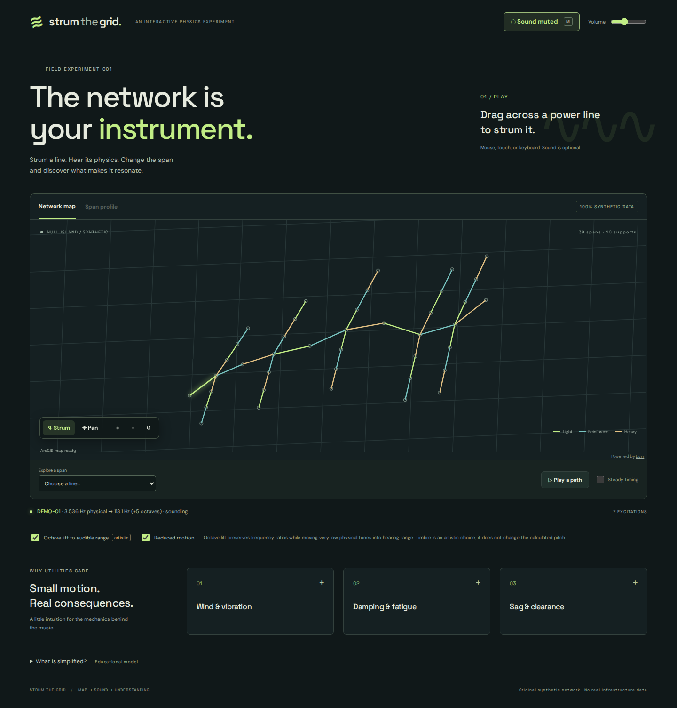
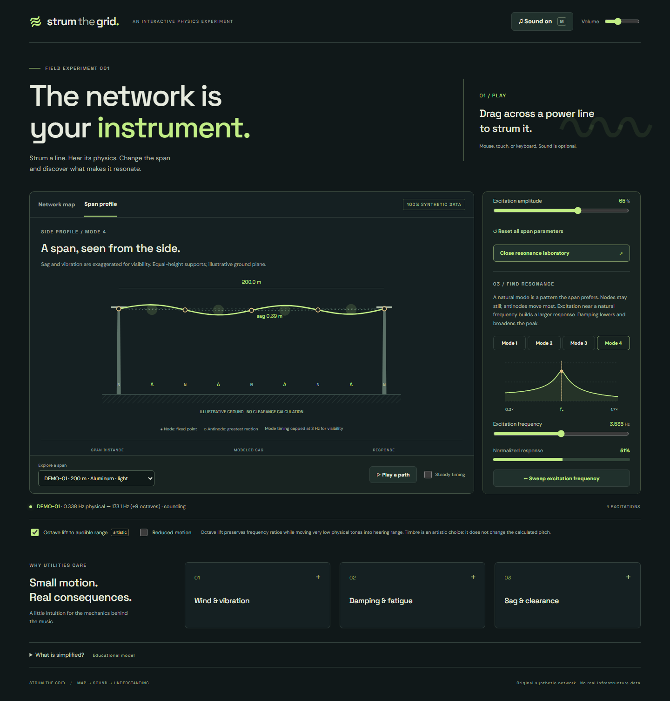

# Strum the Grid

A browser instrument that turns a **fictional overhead network** into playable strings. Drag across a span, see it vibrate, and hear a tone derived from length, tension, and mass. Change those parameters, inspect sag, and discover resonance through four ideal natural modes.

Built with React, TypeScript, Vite, the ArcGIS Maps SDK for JavaScript, and Web Audio. The default experience runs entirely from bundled synthetic GeoJSON with local SDK assets and fonts: no backend, account, API key, basemap service, or real infrastructure data is needed.





## Run locally

Use Node.js 22.12+ (Node 22 LTS recommended) and npm:

```sh
npm install
npm run dev
```

Open the URL printed by Vite, normally `http://127.0.0.1:5173`. Install copies ArcGIS workers, WASM, images, and localization files to ignored `public/arcgis/`; they are included in the static build. Do not skip lifecycle scripts, or run `node scripts/copy-arcgis-assets.mjs` afterward.

## Try the learning loop

1. Choose **Enable sound + octave lift** to opt into audio and the disclosed artistic octave transformation. Most actual model frequencies are below human hearing; uncheck **Octave lift to audible range** to return to physical pitch. Audio is created only after the enable gesture.
2. Drag across lines to strum them. Tap a line to select and preview it. A span glows even with sound disabled or muted. Switch to **Pan** for map navigation; use zoom buttons and reset to explore.
3. Choose a span from the selector, or focus the map and use **Left/Right** to select and **Space/Enter** to play. The preview button provides another keyboard/touch route. **M** toggles mute; master volume remains available on mobile.
4. Open **Change the physics**. Increase reference tension and see the calculated fundamental rise. Sliders change separate per-span overrides; use individual reset buttons or **Reset all span parameters** to restore source values.
5. Open **Span profile** to see modeled sag and equal-height supports. Warmer temperatures reduce modeled tension and increase sag under the explicitly simplified educational curve.
6. Open the **resonance laboratory**, choose modes 1–4, and move excitation toward the natural mode. The response curve, node/antinode pattern, visual amplitude, and bounded audio cue agree. Try increasing damping or running a frequency sweep.
7. **Play a path** performs a deterministic connected walk. **Steady timing** is an opt-in timing interpretation. Conductor families change partial balance, while pitch still comes from physics. Stop cancels pending events.

**Reduced motion** follows the system preference initially and can also be selected manually. **Silent mode** preserves all learning feedback. The model limitations and utility notes are available from the page without sound.

## Quality checks

```sh
npm run typecheck
npm run lint
npm test
npm run build
npx playwright install chromium
npm run test:browser
```

`npm run check` runs typecheck, lint, unit/integration tests, and the production build. Run the build before browser tests: they serve the actual static output and run the real ArcGIS view and Web Audio on desktop Chromium and a Chromium mobile/touch emulation, including the primary learning path, strumming, keyboard play, mute/reduced motion, and sequencing. They reject uncaught errors and external runtime requests. Browser coverage is not a claim of real-device or Safari/Firefox verification.

On Windows, if a preexisting global npm shim is broken, call the working npm CLI directly, for example `node "C:\Program Files\nodejs\node_modules\npm\bin\npm-cli.js" install`. After installation, `node node_modules/vite/bin/vite.js --host 127.0.0.1` runs the app directly. No global tools need to be changed.

## Static deployment

```sh
npm run build
npm run preview
```

Host `dist/` on any static host. For a subdirectory, set `VITE_BASE_PATH` during the build, e.g. `/strum-the-grid/`; Vite modules, fonts, and ArcGIS assets resolve relative to it. No client secrets are required.

`.github/workflows/ci.yml` runs all checks and desktop/mobile browser tests on pull requests and `main`. `.github/workflows/deploy.yml` gates deployment on the same checks and publishes `main` to GitHub Pages using `/strum-the-grid/`. In repository **Settings → Pages**, choose **GitHub Actions** as the source. Pages must be available for the repository's visibility and account plan. Setup currently returns HTTP 422 because the current plan does not support Pages for this private repository; make the repository public or enable a compatible plan before retrying.

After setup, push to `main` or run **Deploy GitHub Pages** from the Actions tab. The deployment job reports the actual site URL. The `verify-hosted` job then runs all four desktop/mobile scenarios against that URL, checking the public learning loop, keyboard/touch interaction, audio, and hosted assets. Its screenshots and failure traces are saved as `hosted-browser-test-results`. A live demo link will be added after successful publishing and verification.

To repeat the checks against an existing deployment, set `PLAYWRIGHT_BASE_URL` to the full site URL, including its subdirectory and trailing slash. This skips the local preview server and does not require a local build:

```sh
PLAYWRIGHT_BASE_URL=https://YOUR-HOST/strum-the-grid/ npm run test:browser
```

In PowerShell, use `$env:PLAYWRIGHT_BASE_URL = 'https://YOUR-HOST/strum-the-grid/'` followed by `npm run test:browser`. Install Playwright Chromium first as described above.

## Architecture

```text
src/app/             state, immutable parameter overrides, cancellable sequencing
src/data/            normalized contracts, runtime validation, bundled GeoJSON adapter
src/physics/         pure SI-unit calculations, configurable educational temperature curve
src/audio/           gesture-gated context, 12-voice synthesis, envelopes, compression, mute
src/map/             ArcGIS lifecycle, projection, pure segment crossing and hit testing
src/visualization/   normalized excitation, sag/modes, bounded resonance response graphic
src/learning/        progressive educational content and model limitations
src/ui/              keyboard-operable controls and responsive styles
tests/               real-browser learning and input paths
```

Map wave animation updates SVG paths outside the React render loop, is limited to recent excitations, and stops after decay. Profile animation cancels on exit and has a static reduced-motion variant. Audio voices release/disconnect on decay and steal the oldest voice with a short fade at the cap. Sequence and sweep timers cancel on stop or unmount. The base GIS/source geometries remain unchanged.

See [SPEC.md](./SPEC.md), [physics assumptions](./src/physics/README.md), [data provenance](./src/data/README.md), and [implementation acceptance notes](./docs/IMPLEMENTATION.md).

## Educational model and data policy

This is an ideal flexible-string approximation with a parabolic sag profile and a simple damped oscillator response. Frequency is never quantized to a scale. Octave lift, timbre, timing, and exaggerated displacement are disclosed presentation choices. This is **not engineering design software** and does not predict failure, health, loading, or clearance compliance.

The 39 spans and 40 supports are original synthetic records around Null Island. No proprietary SCE geometry, IDs, screenshots, internal service URLs, credentials, or sensitive operational attributes are present. Future authorized data belongs behind `SpanDataSource`; the public core remains independent of it. Telemetry is omitted.
